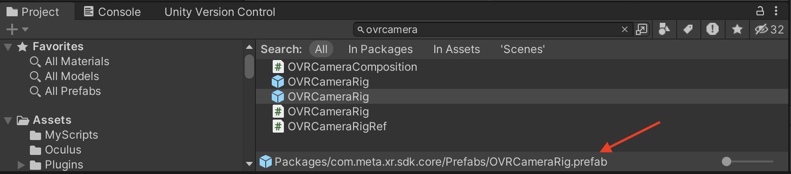
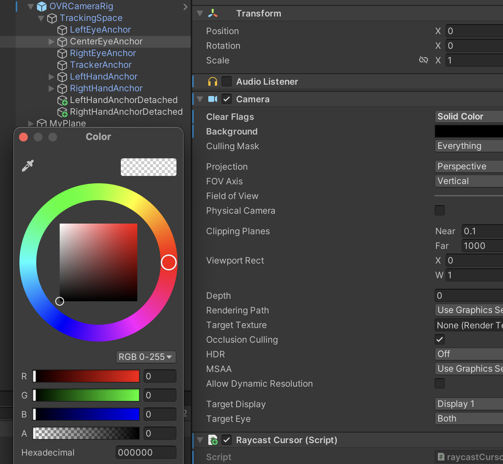
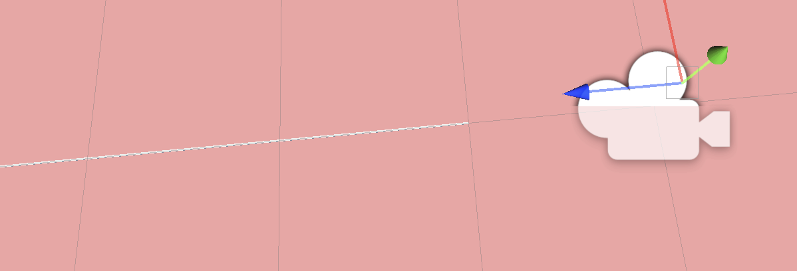
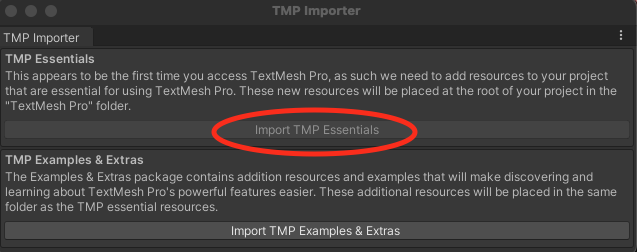

# Assignment 1 - Unity basics (graded, unweighted)
All the assignments will be based on a point system. All assignments will have a certain amount of points avaiable. To 
reach a 100% grade you must get at least 10 points, where each _1 point = 10%_. All assignments will have more than 10 points available, to give you 
more flexibility and challenges for those willing to try! **You need at least 5 points to pass the assignment, which 
will grant you a grade of 50%** **Anything under 5 points will result in a 0%** 

This assignment is unweighted which means that your grade will not affect in any way your final grade but is useful for 
you to get familiar with Unity, the grading and the objectives. Things that you do on this first assignment will be 
reused for the second assignment.

Because this is the first assignment you also have a guide to help you with the initial setup. 

## Initial setup
First you will need to get up and running on Brightspace and Gitlab.

### Find a group
Find a group of 3 members and do the following:
1. Log into [Brightspace](https://brightspace.au.dk/d2l/home/54941)
2. Click "Course Tools" -> "Groups" in the navigation bar
3. Click "View Available Groups"
4. Find an suitable group and click "Join group"

### Setup Gitlab ([Video Guide](https://www.youtube.com/watch?v=jZUpa-EqS_Y))
1. Create a **private** project on https://gitlab.au.dk using [this project](https://gitlab.au.dk/ar/ar-s24) as a template. Guide:
   1. One group member go to https://gitlab.au.dk.
   2. Click: `new project`.
   3. Click: `Import project` (do not Create blank project nor Create from template).
   4. Click: `Repo by URL`.
   5. Then fill in the following information:
      * Git repository URL: `https://gitlab.au.dk/ar/template.git`
      * Project name: `[YOUR PROJECT NAME]` (e.g. `AR24`)
      * Visibility level: `Private`
   6. Click: `Create project`
2. Invite your group members and TA's (as reporters: @mathiasl, @juan) to the project. This can be found under: `Project information` --> `Members`. 

## Install
The next step is to [download and install the Unity Hub and Unity Editor](https://learn.unity.com/tutorial/install-the-unity-hub-and-editor). During this process, you will need to [select a Unity plan and create a Unity ID](https://learn.unity.com/tutorial/unity-plans-what-s-right-for-me-1) if you don’t have these already.

We have made a general [walk through on Youtube](https://youtu.be/GzztvX8aJVc), which show you the installment process. But please use the information below, such that you use the right versions, folders, and so on. 

### Install Unity Hub + Unity ([Video Guide](https://www.youtube.com/watch?v=GzztvX8aJVc))
1. Download the [Unity hub](https://unity.com/download). When you have installed Unity Hub, you can acquaint yourself with Unity Hub by following [this tutorial](https://learn.unity.com/tutorial/get-started-with-the-unity-hub?uv=2019.4). 
2. To install Unity, do the following in Unity Hub:
   1. Click: `Installs` (left menu)
   2. Click: `Install Editor`
   3. Select Unity version: **2022.3._xx_ LTS (where _xx_ is not that important, so just pick the newest version. For ease of use, please select the same _xx_ within the group) and click: `Install`.
   4. You are now asked to Add modules. You must install the following:
      * Dev tools
        * [x] Visual Studio (Only if you want to use Visual Studio, for Jetbrains Rider instead, see exercise 2)
      * Platforms
        * [x] Android Build Support (Quest 2 run a custom Android variant, so we need this)
          * [x] Android SDK & NDK Tools
          * [x] OpenJDK
      * Documentation
        * [x] Documentation
      
      Click `Continue` and `Install` (if you selected Visual Studio) or just `Install`.

### Install dependencies
1. [Meta XR all-in-one ](https://assetstore.unity.com/packages/tools/integration/meta-xr-all-in-one-sdk-269657)
   1. Click: `Add to My Assets`
   2. Open in Unity
   3. Import All
2. [Meta XR simulator](https://assetstore.unity.com/packages/tools/integration/meta-xr-all-in-one-sdk-269657) (Only if using Windows, also Optional)
   1. Click: `Add to My Assets`
   2. Open in Unity
   3. Import All

### Create a new project and push it to git
This is a two stage rocket. To begin with, one of your team **HAVE TO** do some things on only their computer. Then do the rest on the other group members' computers.

#### First group member
1. Clone your gitlab repository you created in before to our computer. You should now have a folder somewhere, say: `~/[YOUR PROJECT NAME]`.
2. Open Unity Hub and create a new **3D Core** project. 
   * _project name_: `AR24` 
   * _Location_: `~/[YOUR PROJECT NAME].
3. Copy the `.gitignore` file from ~~/[YOUR PROJECT NAME]` into `~/[YOUR PROJECT NAME]/AR24`.
4. Commit and push everything to git (that should be around 25 new files).
5. Your folder structure on https://gitlab.au.dk should look like this (if not, try again):
    ```
    . 
   ├── AR24
   │   ├── Assets                     # Created when you made a new Unity project
   │   ├── Packages                   # Created when you made a new Unity project
   │   ├── ProjectSettings            # Created when you made a new Unity project
   │   └── .gitignore
   ├── Assignments
   │   ├── assignment_1.md
   │   ├── assignment_2.md
   │   ├── assignment_3.md
   │   ├── assignment_4.md
   │   └── assignment_5.md
   ├── .gitignore 
   └── README.md 
    ```
#### Second and third group member.
1. Wait for you first group member to push and verify that everything went well.
2. Clone your gitlab repository
3. Open Unity Hub and open your project: `~/[YOUR PROJECT NAME]/AR24`.

### Install Rider (optional)
When you install a Unity version with default settings, Visual Studio will also be installed.
However, if you like the IDE's from Jetbrains, you can also use Rider.
1. Install [JetBrains Toolbox App](https://www.jetbrains.com/toolbox-app/)
2. Create a JetBrains Account (free as a student)
3. Install Rider directly from JetBrains Toolbox
4. Start using Rider with your Unity project ([link](https://www.jetbrains.com/help/rider/Unity.html))

## Your first Unity application
Create a new scene in your project, remove the Main Camera object. Search for the OVRCameraPrefab and drag it into your
hierarchy to add it (make sure you add the one coming from _com.meta.sdk.core/Prefabs_ and not the other one)



Add a new plane, make it's scale 1,1,1 position 0,0,0

Let's now change a few adjustments of the `OVRCamera`. Click on it on the hierarchy, and scroll down to the component
`OVR Manager`, there change the `Tracking Origin Type` to floor level. Then, click the option `Enable passthrough`, add 
the component `OVR passthrough layer`, set the varible `Placement` to underlay. Lastly, go navigate to `OVRCameraRig` in
the hierarchy then open it, then open tracking space, then click `center eye anchor`. In the inspector of the object 
navigate to the camera component and set clear flags to solid color and change the color to black with alpha value of 0 
(see screenshot)



After doing this, if you compile the project, you should be able to see the virtual plane and the world around you, so 
now you can start with the assignment 

### Write difference between start and update methods (_1 point_)
### What is raycast, when should you use it? (_1 point_)
### Make an object continuously rotate (_1 point_)
Hint: Add a script component to an object you add to the scene, one of the methods that by default come with the new 
script might be useful for your task (_Start_ and _Update_ are the methods created by default)
### Visual representation of headray (_1 point_)
Hint 1: Look inside the hierarchy of the OVRCameraRig prefab, is there any place there that you could make an new object 
as a child so that the object will always be rotated and placed towards where the user is facing (without the need of 
scripts)?

Hint 2: a ray can just be a cube, very thin on two dimensions and very large on the third one, leave some space from the 
user's head to the ray to not make it that annoying when using the app (see image)



### Cursor on the floor on last location in plane (in a plane, _2 points_)
Create a cursor object (a circle will suffice but feel free to try other objects) that stays on top of the plane in the 
location the headray is colliding. The cursor object shall not leave the plane.

Hint: Use [raycast](https://docs.unity3d.com/ScriptReference/Physics.Raycast.html) to determine when the ray is 
colliding with the plane and if it is move the cursor. You will need a reference in the script (Remember
`[SerializedField]`?) to your cursor gameobject, the same object that is the parent of your headray is good place for 
this new script.


### Objects change color/state upon headray hit (1 point)
Make it so that when the headray touches objects (i.e: cubes) it changes color.

Feel free to do something more elaborate than changing the color upon rayhit, the change of color is just an easy 
example, it is only important that visually something changes upon the ray hits.

Hint: Using raycast from the same script as the cursor and checking which obj is the ray colliding with might be the 
easiest way to implement this.
### Object goes back to original color/state upon stop stop headray hit  (_1 point_)
Similar to before, just make sure to turn the color back when the ray is not longer hitting the object

Hint: Store the object you are hitting, so when you are no longer hitting it you can set its color back
###  5 second headray pointing to obj deletes it (2 point)
Hint: you can use the [Destroy](https://docs.unity3d.com/ScriptReference/Object.Destroy.html) method to delete an object
, another option would be to just use [SetActive](https://docs.unity3d.com/ScriptReference/GameObject.SetActive.html) to 
hide the object

### Text object always rotates towards user (so is readable) (1 point)
When you try to add text for the first time (`3D Object` -> `Text - TextMeshPro`) it might ask you to import some things
, import them. Import the Examples and Extras if you want too.



Hint 1: Use the [LookAt](https://docs.unity3d.com/ScriptReference/Transform.LookAt.html) method

Hint 2: Create an empty parent to the Text object, and make it so that it rotates using the LookAt method, then rotate 
the Text object rotate 180 degrees on the y axis in the inspector. No script is needed as component on the Text object 
itself, only the parent.

## Recap
For your convenience, find the objectives and points here in a table format. Remember you will need at least 5 points to 
pass the assignment. (This one will be graded but unweighted, but future ones will be both graded and weighted for your
final grade)

| Item                                                                  | Points | Done? (✅/❌) | 
|-----------------------------------------------------------------------|--------|-------------|
| Write difference between start and update methods                     | 1      |             |
| What is raycast, when should you use it?                              | 1      |             |
| Make an object continuously rotate (_1 point_)                        | 1      |             |
| Visual representation of headray (_1 point_)                          | 1      |             |
| cursor on the floor on last location in plane (in a plane, 2 points)  | 2      |             |
| Obj changes color upon headray hit (1 point)                          | 1      |             |
| Obj goes back to original color upon stop stop headray hit  (1 point) | 1      |             |
| 5 second headray pointing on obj deletes it (2 point)                 | 2      |             |
| Text object always rotates towards user (so is readable) (1 point)    | 1      |             |

# Submission

Submit the following 
* **A Short video:** (under 2 minutes) in which all the points of the assignment are demonstrated (of course ignore the
written items for the video). Please try to showcase all the items in order. Don't worry about your video being short, 
if all the items are shown then is perfect.

* **Build file (apk):** Apk build file that results from the building process.
* **Source code:** The repository you are using, just include in your release your latest commit with the assignment 
done
* **Written answers:** In a _readme.md_ file located root of your source code submitted in the release
* **Recap table filled:** In that same _readme.md_ file, copy the table from the recap section and mark with ✅/❌ 
whether you implemented such feature or not (This will help us avoid looking for features in your video/code you didn't
implement)
* **Brightspace:** The direct link to the release in your gitlab project in which you include all the items mentioned 
above (remember to include us as members of your project or we won't be able to access it @juan @mathiasl)

